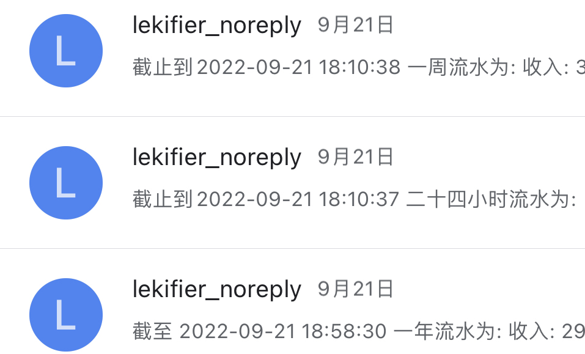
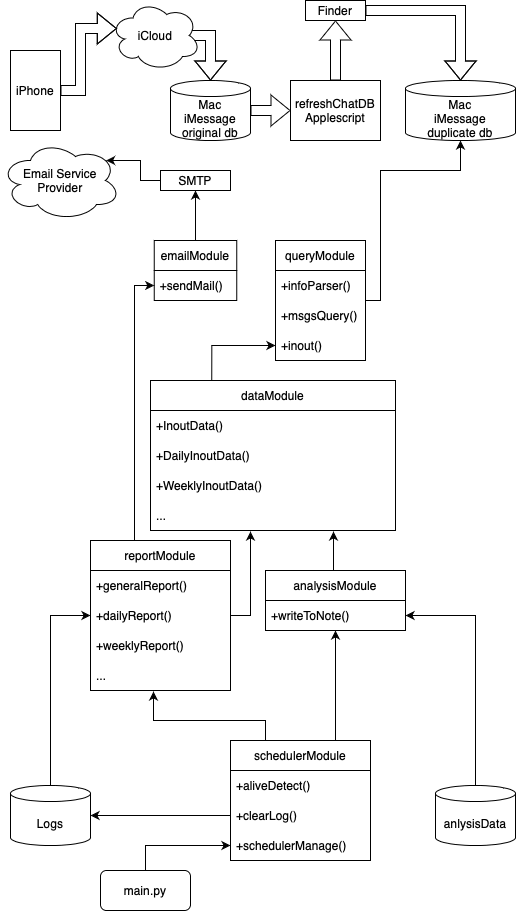

# iMessage Catch Cash Flow

Automatically catch and report your daily weekly,
monthly, yearly cash flow from iPhone's Message
app.

[中文介绍](README_CN.md)

[中文博客](https://www.lekifier.cn/利用短信在icloud中同步的机制自动化整理日常消费流水账篇1)

Assuming you have a credit card used for daily
consumption, and the credit card MUST have the
service supported by bank that sending message
your every transactions to your iPhone. A Mac is
Also needed, for dealing with message data.
You can "[Store your messages in iCloud so that you can see the same messages on all devices if you use Messages on more than one device.](https://support.apple.com/guide/messages/icht39422/mac)",
login your iPhone and Mac with the same iCloud
account. There are many introduction on Youtube,
I guess.

Because cash reports need to be sent to your email
, so, you need to set up a email account as a
postman. Or you can choose to send and receive
your cash report by only one email account.
Attention, SMTP service is required, by the way.

DO NOT directly RUN `install.sh`, you need to
make sure things are configured right and
than install it.

## Dependent

I recommend python3, I'm not sure python2 can do
do the same work. But you need to make sure the
[Shebang](<https://en.wikipedia.org/wiki/Shebang_(Unix)>) in `main.py` is right, I use
`#!/usr/opt/homebrew/python3` you may need another
version python.
Make sure your installed library by PIP is
corresponding to you python wrote in Shebang.
I used third party python library(maybe
just one), so you need more installation. The file
is `requirements.txt`. Of course you can run
`pip3 install -r requirements.txt`
the command has wrote in `install.sh`.
You need to know that.

## There are some Configs you need TODO

There are FOUR files you need to configure:
`refreshChatDB.applescript`

`catchCashFlow.cfg`

`com.catchcashflow.core.plist`

`com.catchcashflow.refreshchatdb.plist`

I note the "TODO" key word in the 4 files to
show where you need to change.

(Optional) There are FOUR files I add Shebang, you
may need to change the path to your python3 path
or shell path:
`refreshChatDB.applescript`

`main.py`

`install.sh`

`uninstall.sh`

## A Simple "Installation" ?

Here is a file called `install.sh`, but actually,
it just simply run 2 `launchctl` as daemon in your
Mac. The launchctl can run automatically when you
login your account after Mac system boot.
Two cp, one load. You can just peek the install
file.

## A Simple "Uninstallation"?

Just one unload. Peek `uninstall.sh`.

## Feature Work

To be continue, I'm very happy if you can write
some issues in this repository.

## You may want to know more about it

If you speak chinese, you can read my blog
[中文博客](https://www.lekifier.cn/通过icloud的同步机制实现自动化整理日常消费流水账篇1), writing many things about my ideas
and how ideas come to be.

Here I mainly talk about the program itself.

### Basic Idea

Data we need flows from iphone to icloud and then
mac receive the data from icloud. So, we need to
catch the data from Mac. Although Mac has SIP, we
can just make a duplicate using Finder.
Applescript can help us to run the duplicate
command background (deal with Finder's copy sounds
just cost my time to debug). Finally, all we need
to do is make sure the duplicate and core python
program run automatically. That's all.

### Core program design

There are lots of task our core program need to,
so I designed 6 modules in the `modules` folder.
Here is the diagram of our core program, easy to
understand.

Copyright(c) 2022 Lekifier
