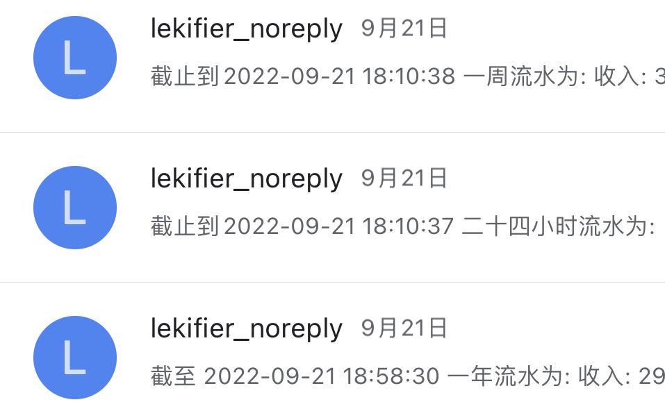
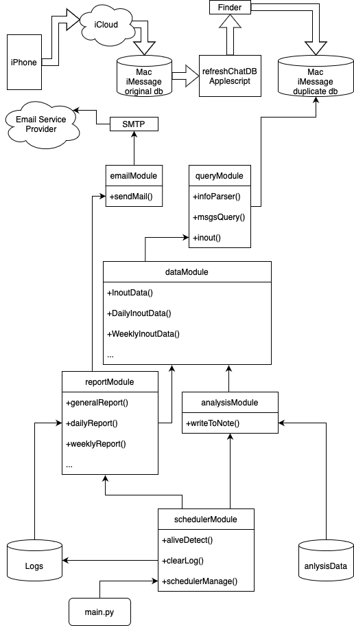

# iMessage Catch Cash Flow

代码所构建的系统自动地从 iPhone 的 Message App 中抓取并
报告每天，每周，每月，每年的流水账。

[中文介绍](README_CN.md)

[中文博客](https://www.lekifier.cn/通过icloud的同步机制实现自动化整理日常消费流水账篇1)

这套系统的前提是有一张用于日常消费的银行卡，并且开通了银行的
短信服务，每笔交易都会发送短信到你的 iPhone 上。除此之外,
还需要一台 Mac 来处理短信数据。通过 iCloud 来
[同步你的短信](https://support.apple.com/guide/messages/icht39422/mac)，
使用同一个 iCloud 账号登录你的 iPhone 和 Mac。
我想, bilibili 会有许多相关的教程。

因为流水账报告需要发送到你的邮箱，所以你需要设置一个邮箱账号
作为发报员 (postman)。或者你用同一个邮箱账号来发送和接受
报告并且需要你的邮箱支持 SMTP 协议。

千万注意不要直接运行 `install.sh`，你需要确保一切配置都
正确，然后再安装。

## 依赖 Dependent

我推荐使用 python3，我不确定 python2 是否能够完成同样的工作。
但是一定要确保 [Shebang](https://zh.wikipedia.org/wiki/Shebang) 在 `main.py` 中正确，
我在代码中使用`#!/usr/opt/homebrew/python3`，你可能需要
另一个版本的 python。
确保你通过 PIP 安装的第三方库是和 Shebang 中一致的 python
版本。
代码是用来 python 的第三方库，虽然好像我只用到了一个。
所以你也得安装，需要的东西写到了 `requirements.txt` 中。
你可以运行`pip3 install -r requirements.txt`来安装。
不过这条命令已经写到`install.sh`中了。

##需要做的一些配置 Configuration

四个文件需要进行配置

`refreshChatDB.applescript`

`catchCashFlow.cfg`

`com.catchcashflow.core.plist`

`com.catchcashflow.refreshchatdb.plist`

文件中我已经通过 TODO 的关键词标注了需要修改的地方。

需要注意的是，同时也有四个文件我加了 Shebang
比如`#!/usr/bin/env python3`，需要根据
自己环境下的路径来进行修改。

`refreshChatDB.applescript`

`main.py`

`install.sh`

`uninstall.sh`

## 就当是一种「安装」吧

文件中有一个叫做`install.sh`的脚本，你可以运行它来安装。
但是需要注意，这个东西既没有编译也没有复杂的操作，他主要做的
工作就是跑起来两个基于`launchctl`作为守护进程
不过这两个守护进程可以在登录 Mac 之后自动运行
主要安装的命令就两个部分，两个 cp，一个 load，
你阔以在`install.sh`文件中康一康。

## 那就也有「卸载」

就一个 unload，没啥复杂的的。

## 之后计划开展的工作

有一些想法了已经，但是卖个关子先，不过如果大家可以不吝 issue
我会很开心。

## 关于这个小项目更多的东西

一些思路想法和心路历程卸载了我的[博客](https://www.lekifier.cn/通过icloud的同步机制实现自动化整理日常消费流水账篇1)中，大家阔以康一康。

这里我就简单地聊一下程序本身如何实现的。

### 核心想法

我们需要传输的数据实际上从 iphone 流过了 iCloud，之后又到了
mac 端，在 mac 端需要绕开 SIP，利用 applescript 操纵 Finder 来
进行数据拷贝。之后我们只需要将数据更新和核心程序自动化调度
就可以了。

### 项目的程序设计

因为我们的程序需要完成多种工作，所以我设计了 6 个模块去完成整体
架构，模块都在 `modules`文件夹下。以下是整个项目的简单设计图。

